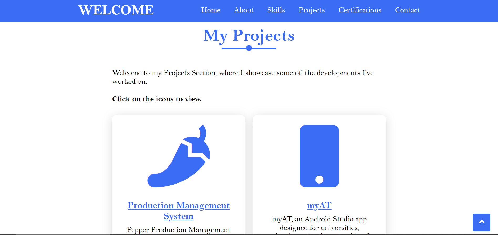

Welcome to my portfolio! 
- This repository contains the files for my personal portfolio website, showcasing my skills, projects, and experiences.

Screenshots:

Live Demo :
- You can view my portfolio online at: https://deekshadevadigaa.github.io/deekshaportfolio/

Features :
- About Me: Information about my background and skills.
- Projects: A showcase of projects I have worked on.
- Contact: Ways to get in touch with me.

Libraries and Frameworks Used :
1. Font Awesome:
   - Library: Font Awesome (for icons)
   - Version: 5.15.2
   - CDN: https://cdnjs.cloudflare.com/ajax/libs/font-awesome/5.15.2/css/all.min.css
   - Usage: Icons such as fas fa-angle-up, fas fa-paint-brush, etc.
   - 
2. CSS Stylesheet:
   - Local Stylesheet: style.css
   - Purpose: Custom styling for the website.
   - 
Features of my portfolio:
1. Navigation Bar Effects:
   - Sticky Header: The header sticks to the top of the page when you scroll.
   - Responsive Sidebar Menu: A button to toggle the navigation menu on smaller screens.
2. Scroll-to-Top Button:
   - Functionality: Appears when the user scrolls down and allows scrolling back to the top.
3. Element Reveal on Scroll:
   - Effect: Elements with the class .reveal become visible as the user scrolls.
4. Interactive Sections:
   - Skills Section: Cards that link to external pages or resources related to different skills.
   - Projects Section: Displays your projects with links to GitHub repositories and a video demo.
   - Certifications Section: Showcases various certifications with images and descriptions.
   - Contact Section: Provides links to various contact methods, including email, social media, and more.
  
Technologies Used :
- HTML5: For structuring the content of the portfolio.
- CSS3: For styling and layout.
- JavaScript: For any interactive features.
- Visual Studio Code (VSCode): Code editor used for development.
- Font Squirrel Webfont Generator: Used to generate web fonts with specific settings. The configuration file for font generation is included in this repository.

Deployment :
- Deployed using [GitHub Pages](https://pages.github.com/). For details on how to deploy, refer to the [GitHub Pages documentation](https://docs.github.com/en/pages).
